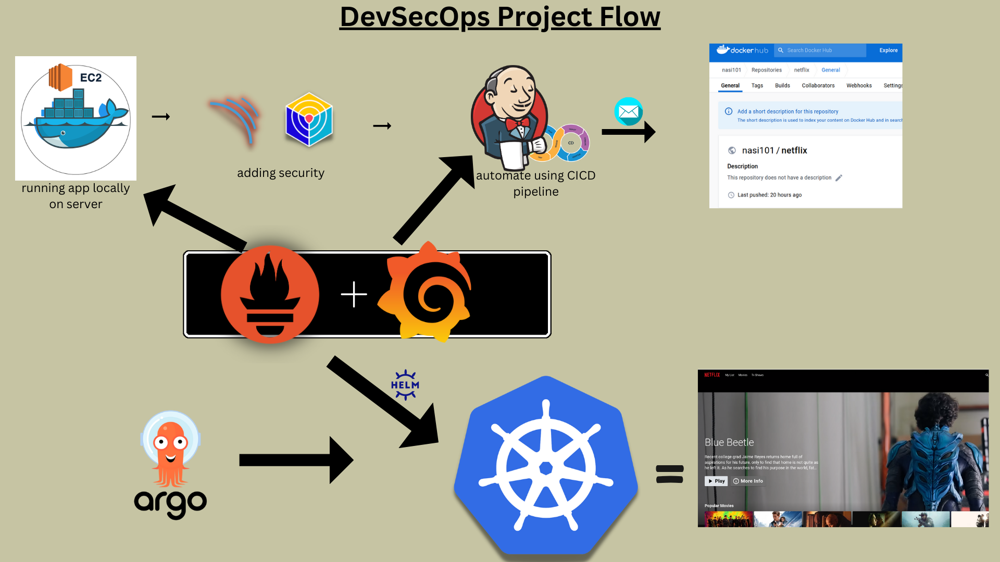
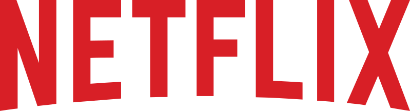

<div align="center">
  

  <br>
  <a href="http://netflix-clone-with-tmdb-using-react-mui.vercel.app/">
    
  </a>
</div>

<br />

<div align="center">
  
  <p align="center">Home Page</p>
</div>


# Deploying a Netflix Clone with DevSecOps & Cloud Automation

## 🚀 Overview

This project is a hands-on implementation of deploying a **Netflix Clone** on a cloud environment with a complete **CI/CD pipeline** using **Jenkins**. It follows modern **DevSecOps** best practices, ensuring security is embedded at every stage of development and deployment. The pipeline automates building, testing, security scanning, and deploying the application in a secure and efficient manner.

## 🛠 Tech Stack

### Frontend
- **React.js** / **Next.js** (For building the UI and streaming interface)

### Backend
- **Node.js** (For handling API requests and authentication)

### CI/CD
- **Jenkins** (For automating builds, tests, and deployments)

### Containerization & Orchestration
- **Docker** (For packaging the application)
- **Kubernetes** (For orchestrating containers, optional but recommended)

### Cloud Platform
- **AWS**  (For hosting and scaling the application)

### Security Tools
- **SonarQube** (Static code analysis)
- **Trivy** (Container vulnerability scanning)
- **Snyk** (Security vulnerability detection)

### Monitoring & Logging
- **Prometheus & Grafana** (For performance monitoring)
- **ELK Stack** (For log aggregation)

---

## 📌 Project Workflow

1. **Clone the Repository & Set Up the Environment**
2. **Configure Jenkins Pipeline**
3. **Build & Test the Application**
4. **Run Security Scans (Static & Dynamic Analysis)**
5. **Containerize the Application with Docker**
6. **Deploy to Cloud using Kubernetes / Docker Swarm**
7. **Implement Continuous Monitoring & Logging**

---

## 🔧 Prerequisites

- **Jenkins installed and configured** (with required plugins)
- **Docker & Kubernetes setup** (for containerization & orchestration)
- **AWS/GCP/Azure account** (with necessary permissions)
- **SonarQube, Trivy, and Snyk** (for security checks)

---

## 🚀 Steps to Deploy

### 1️⃣ Clone the Repository
```sh
git clone https://github.com/your-username/netflix-clone-devsecops.git
cd netflix-clone-devsecops
```

### 2️⃣ Set Up Jenkins Pipeline
- Install necessary Jenkins plugins: **Docker, Kubernetes, SonarQube, Trivy**
- Create a new **Multibranch Pipeline**
- Configure the **Jenkinsfile** in the repository

### 3️⃣ Build & Test Application
- Install dependencies:
```sh
npm install
```
- Run unit tests:
```sh
npm test
```

### 4️⃣ Security Scanning
- Run **Static Code Analysis** with SonarQube:
```sh
sonar-scanner
```
- Scan for vulnerabilities using Trivy:
```sh
trivy image netflix-clone:latest
```

### 5️⃣ Dockerize the Application
```sh
docker build -t netflix-clone:latest .
docker run -d -p 3000:3000 netflix-clone
```

### 6️⃣ Deploy to Cloud
- Push the Docker image to a container registry:
```sh
docker tag netflix-clone:latest your-dockerhub-username/netflix-clone:latest
docker push your-dockerhub-username/netflix-clone:latest
```
- Deploy using Kubernetes:
```sh
kubectl apply -f deployment.yaml
```

### 7️⃣ Continuous Monitoring
- **Use Prometheus & Grafana** for real-time monitoring
- **Set up Log Aggregation** with ELK Stack

---

## 🛡️ DevSecOps Best Practices Implemented

✅ **Automated Build & Deployment** with Jenkins  
✅ **Static & Dynamic Security Scanning** (SonarQube, Trivy, Snyk)  
✅ **Container Security Best Practices**  
✅ **Infrastructure as Code (IaC)** for cloud provisioning  
✅ **Continuous Monitoring & Logging** (Prometheus, Grafana, ELK)  

---


